# ForeScore Database Schema

Generated from `postgresql://localhost:5432/forescore_dev`. Refresh with `scripts/dump-schema.sh`.

## Entity Relationship Diagram

```mermaid
erDiagram
    tenants {
        int id PK
        varchar name
        varchar slug
        varchar plan
        varchar subscription_status
        jsonb settings
    }
    users {
        int id PK
        varchar first_name
        varchar last_name
        varchar email
        varchar phone_number
        varchar gender "male|female"
        boolean is_super_admin
    }
    tenant_memberships {
        int id PK
        int tenant_id FK
        int user_id FK
        varchar role "owner|admin|scorer|player"
        timestamptz joined_at
    }
    login_codes {
        int id PK
        int user_id FK
        varchar code_hash
        timestamptz expires_at
        timestamptz used_at
    }
    invitations {
        int id PK
        int tenant_id FK
        varchar email
        varchar role
        varchar token_hash
        timestamptz expires_at
        timestamptz accepted_at
    }
    tours {
        int id PK
        int tenant_id FK
        varchar label
        int year
        varchar location
        varchar status "draft|active|completed"
        varchar gender "mens|womens|mixed"
        boolean is_paid
        boolean skins_enabled
        boolean calcutta_enabled
        int leaderboard_best_of_rounds
        boolean leaderboard_last_round_required
        jsonb tour_prizes
        jsonb daily_prizes
    }
    courses {
        int id PK
        int tenant_id FK
        varchar course_name
        varchar tee_name
        varchar gender "mens|womens|open"
        numeric course_rating
        int slope_rating
        boolean supports_split_ratings
        int api_course_id
        varchar api_tee_key
    }
    holes {
        int id PK
        int course_id FK
        int hole_number
        int par
        int length_meters
        int stroke_index_primary
        int stroke_index_secondary
    }
    golf_rounds {
        int id PK
        int tour_id FK
        int round_number
        int course_id FK
        int female_course_id FK
        date tour_date
        varchar status "draft|open|closed"
        varchar calc_type "stableford|ambrose_nett|stroke"
        boolean leaderboard_published
        boolean two_ball_enabled
        varchar two_ball_type "best_ball|aggregate"
        jsonb ambrose_prizes
    }
    event_players {
        int id PK
        int tour_id FK
        int user_id FK
        varchar status
    }
    player_handicaps {
        int id PK
        int tour_id FK
        int user_id FK
        numeric playing_handicap
    }
    player_day_handicaps {
        int id PK
        int tour_id FK
        int user_id FK
        int round_number
        numeric handicap_index
    }
    tee_groups {
        int id PK
        int tour_id FK
        int round_number
        time tee_time
        varchar tee_location
        int starting_hole
        int group_number
        varchar source "manual|generated"
    }
    tee_group_players {
        int id PK
        int tee_group_id FK
        int user_id FK
        int position
    }
    ambrose_groups {
        int id PK
        int tour_id FK
        int round_number
        int group_number
        time tee_time
        varchar tee_location
        int starting_hole
    }
    teams {
        int id PK
        int tour_id FK
        int round_number
        varchar competition_type
        varchar name
        int ambrose_group_id FK
    }
    team_members {
        int id PK
        int team_id FK
        int user_id FK
        boolean is_dual_assigned
    }
    scorecards {
        int id PK
        int tour_id FK
        int round_number
        varchar type "individual|team"
        int user_id FK
        int team_id FK
        varchar status
    }
    scorecard_holes {
        int id PK
        int scorecard_id FK
        int hole_number
        int gross_score
        int stableford_points
        int owner_user_id FK
        int version
        varchar op_id
    }
    scorecard_edit_logs {
        int id PK
        int scorecard_id FK
        int hole_number
        int previous_gross_score
        int new_gross_score
        int editor_user_id FK
    }
    ambrose_drives {
        int id PK
        int scorecard_id FK
        int hole_number
        int drive_taken_user_id FK
    }
    calcutta_auctions {
        int id PK
        int tour_id FK
        int auctioned_user_id FK
        int buyer_user_id FK
        int owner_user_id FK
        numeric auction_bid_amount
        int draw_order
    }
    novelty_events {
        int id PK
        int tour_id FK
        int round_number
        int course_id FK
        int hole_number
        varchar novelty_type
        varchar label
    }
    novelty_results {
        int id PK
        int novelty_event_id FK
        int winner_user_id FK
        int winner_team_id FK
        boolean is_no_winner
    }
    skins_holes {
        int id PK
        int tour_id FK
        int round_number
        int hole_number
        varchar participant_type
        int winning_participant_id
        numeric base_pot_amount
        numeric carry_in_amount
        numeric total_pot_amount
        varchar status
    }
    skins_carry {
        int id PK
        int tour_id FK
        int from_round_number
        int from_hole
        int to_round_number
        int to_hole
        numeric carry_amount
    }
    leaderboard_snapshots {
        int id PK
        int tour_id FK
        int round_number
        varchar competition_type
        jsonb payload
        timestamptz calculated_at
    }
    itinerary_items {
        int id PK
        int tour_id FK
        date item_date
        varchar type
        time start_time
        time end_time
        varchar title
        text description
        varchar location
        jsonb details
        int sort_order
    }
    session_logs {
        int id PK
        int user_id FK
        int tenant_id FK
        varchar event "login_success|logout|code_invalid|no_membership"
        varchar ip_address
        text user_agent
        timestamptz created_at
    }

    tenants ||--o{ tenant_memberships : ""
    tenants ||--o{ tours : ""
    tenants ||--o{ courses : ""
    tenants ||--o{ invitations : ""
    users ||--o{ tenant_memberships : ""
    users ||--o{ login_codes : ""
    users ||--o{ event_players : ""
    users ||--o{ player_handicaps : ""
    users ||--o{ player_day_handicaps : ""
    users ||--o{ tee_group_players : ""
    users ||--o{ scorecards : ""
    users ||--o{ team_members : ""
    users ||--o{ scorecard_holes : "owner"
    users ||--o{ scorecard_edit_logs : "editor"
    users ||--o{ ambrose_drives : ""
    tours ||--o{ golf_rounds : ""
    tours ||--o{ event_players : ""
    tours ||--o{ player_handicaps : ""
    tours ||--o{ player_day_handicaps : ""
    tours ||--o{ tee_groups : ""
    tours ||--o{ ambrose_groups : ""
    tours ||--o{ teams : ""
    tours ||--o{ scorecards : ""
    tours ||--o{ calcutta_auctions : ""
    tours ||--o{ novelty_events : ""
    tours ||--o{ skins_holes : ""
    tours ||--o{ skins_carry : ""
    tours ||--o{ leaderboard_snapshots : ""
    tours ||--o{ itinerary_items : ""
    courses ||--o{ holes : ""
    courses ||--o{ novelty_events : ""
    courses ||--o{ golf_rounds : "course_id"
    tee_groups ||--o{ tee_group_players : ""
    ambrose_groups ||--o{ teams : ""
    teams ||--o{ team_members : ""
    teams ||--o{ scorecards : ""
    scorecards ||--o{ scorecard_holes : ""
    scorecards ||--o{ scorecard_edit_logs : ""
    scorecards ||--o{ ambrose_drives : ""
    novelty_events ||--o{ novelty_results : ""
    users ||--o{ session_logs : ""
    tenants ||--o{ session_logs : ""
```

## Table Descriptions

### Identity and access

**`tenants`** — One row per golf tour operator. `slug` is the URL prefix (`/:slug/...`). `plan` and `subscription_status` control billing; `is_paid` on the tour gates activation.

**`users`** — Global identity table, shared across all tenants. `gender` is `'male'|'female'` (NOT NULL, default `'male'`). `is_super_admin` is a cross-tenant flag. Email is the login identifier; `phone_number` is optional.

**`tenant_memberships`** — Scopes a user to a tenant with a role (`owner|admin|scorer|player`). A user can belong to multiple tenants. Super admins get a synthetic `owner` membership injected at request time and don't need a real row.

**`login_codes`** — Passwordless auth codes. `code_hash` is SHA-256 of the 6-digit OTP. Expires after 15 minutes; `used_at` stamps single-use.

**`invitations`** — Pending email invitations to join a tenant. `token_hash` is the invite link token.

### Tours and rounds

**`tours`** — The primary event container. `gender` (`mens|womens|mixed`) controls which course pickers appear in the round config UI and which tees are used for handicap calculation. `status` lifecycle: `draft → active → completed`. `is_paid` is set by super admin to activate. JSONB prize fields: `tour_prizes` (championship prizes) and `daily_prizes` (per-round stableford prizes). Note: the DB sequence is still named `events_id_seq` from the original table name.

**`golf_rounds`** — Per-round configuration within a tour. `round_number` is 1-based. `course_id` is the men's/default tee set; `female_course_id` (nullable) is the women's tee set for mixed tours. `calc_type` values: `stableford`, `ambrose_nett`, `stroke`. `ambrose_prizes` is JSONB `[{label, amount}]`. DB sequence still named `event_day_statuses_id_seq`.

**`itinerary_items`** — Non-golf schedule entries attached to a tour (meals, travel, free days, etc.). `type` and `details` (JSONB) are open-ended for flexible event kinds. `sort_order` controls display sequence within a day.

### Courses

**`courses`** — Each row is a specific tee set at a course (e.g. "Bonville — Blue Tees"). `gender` (`mens|womens|open`) determines which picker it appears in — `open` shows in both men's and women's dropdowns. `api_course_id` and `api_tee_key` link to the external Golf Course API; `api_tee_key` uses `m:`/`f:` prefix for API calls (separate from stored `gender`). `course_rating` and `slope_rating` are used for WHS handicap calculation. `supports_split_ratings` (boolean, default false) — when false, `stroke_index_secondary` is computed as `stroke_index_primary + 18` and not stored independently; when true, all 36 SI values are editable and stored.

**`holes`** — 18 (or 9) holes per course. `stroke_index_primary` (1–18) is the standard SI; `stroke_index_secondary` (19–36) is used when a player's handicap exceeds 18 strokes.

### Players and handicaps

**`event_players`** — Roster of players registered for a tour. DB table name is `event_players` (not renamed by migration 012). `status` is typically `'active'`.

**`player_handicaps`** — Tour-level raw handicap index per player. `playing_handicap` (decimal 5,1) is the handicap index entered at registration.

**`player_day_handicaps`** — Per-round handicap override. Falls back to `player_handicaps.playing_handicap` when absent. The actual playing handicap (strokes received) is always computed in real-time: `ROUND(handicap_index × (slope/113) + (rating − par))`.

### Tee times

**`tee_groups`** — A starting group for a round. `source` is `'manual'` or `'generated'` (distribute/reverse-leaderboard algorithms). Locked once the round leaves `draft`.

**`tee_group_players`** — Player assignment within a tee group. `position` (1–4) determines 2-ball pairing: positions 1+2 = ball A, 3+4 = ball B.

### Scoring

**`scorecards`** — One per player (type `individual`) or team (type `team`) per round. Keyed by `tour_id + round_number + user_id` or `team_id`.

**`scorecard_holes`** — Per-hole gross score and computed stableford points. `version` + `op_id` enable optimistic concurrency; upsert throws `VERSION_CONFLICT` on mismatch. `owner_user_id` tracks which player in an ambrose team entered each hole.

**`scorecard_edit_logs`** — Audit log of scorer-made corrections.

### Ambrose

**`ambrose_groups`** — The 4-player ambrose team grouping for a round (separate from `tee_groups`). Links to `teams` via `teams.ambrose_group_id`.

**`ambrose_drives`** — Records which player's drive was selected on each hole for an ambrose scorecard.

### Teams

**`teams`** — Generic team container used for ambrose, 2-ball, and other competition types. `competition_type` identifies the format. `ambrose_group_id` is set for ambrose teams.

**`team_members`** — Players in a team. `is_dual_assigned` allows a player to appear on both individual and team scorecards.

### Competitions

**`calcutta_auctions`** — Auction result per player per tour. Three user FKs: `auctioned_user_id` (the player), `buyer_user_id` (who paid the bid), `owner_user_id` (optional fractional reseller).

**`novelty_events`** — Nearest-to-pin or long drive competitions, tied to a specific hole on a specific round.

**`novelty_results`** — Winner of a novelty event. Nullable `winner_user_id` / `winner_team_id`; `is_no_winner` when no result recorded.

**`skins_holes`** — Per-hole skins result. `participant_type` distinguishes individual vs team skins. `base_pot_amount + carry_in_amount = total_pot_amount`.

**`skins_carry`** — Tracks pot carry-forwards when a hole is tied (no skin won).

### Leaderboard

**`leaderboard_snapshots`** — Cached leaderboard payloads. `competition_type` identifies which board (championship, day, eclectic, skins, ambrose). Rebuilt when `tours.leaderboard_dirty_at` is set.

### Auth / session

**`session_logs`** — Immutable audit log of auth events. `event` values: `login_success`, `logout`, `code_invalid`, `no_membership`. `tenant_id` is null for super admin logins (which have no tenant context). Rows older than 180 days are deleted by a cleanup job in `server.js` that runs on startup and every 24 hours. Viewable system-wide at `/session-logs` (super admin only).
